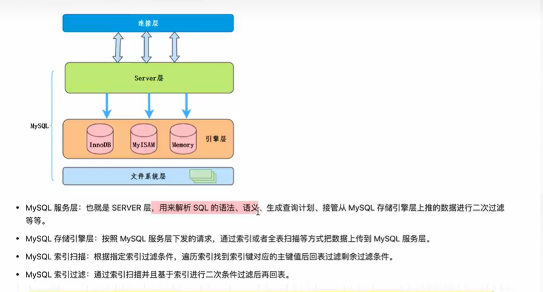

# 索引
## 索引的分类
1. 数据结构分类：B+树索引、hash索引、Full-text索引
2. 物理存储分类：聚簇索引（主键索引，innodb中索引值和数据一起存储）、二级索引（辅助索引，索引值和主键id）
3. 字段特性分类：主键索引、唯一索引（数据不可重复）、普通索引（数据可重复）、前缀索引（只会根据前几位作为索引值）
4. 字段个数分类：单个索引、联合索引（多个值索引）


## 索引的优缺点

数据是存储在磁盘上的，操作系统读取磁盘的最小单位是块，如果没有索引，会加载所有的数据到内存，依次检索，磁盘io多

---
优点：
1. 索引可以提高检索效率，降低io成本
2. 通过创建唯一性索引，可以保证每一行数据的唯一性，拒绝脏数据
3. 在使用分组和排列子句进行数据检索时，可以减少查询中分组和排序的时间
4. 加速两个表之间的连接，一般是在外键上创建索引

缺点：
1. 创建索引需要占据物理空间
2. 创建索引和维护索引需要耗费时间，数据量越大索引越多，时间越长
3. 会降低表的增删改的效率，每次进行操作时需要对索引进行维护，导致时间变长
---
### 创建索引一定可以提升效率吗？
不一定，应该避开缺点。
1. 对查询中使用的少的字段尽量不要创建索引，创建索引是需要成本的。
2. 对数据密度小的列不建议创建索引。innodb的辅助索引存在回表，数据密度小不如全表扫。

### B+树索引
平衡二叉树演化而来。二叉树有极端情况深度太深了，查找效率和链表差不多了。平衡二叉树代价更大，插入数据时需要不断左旋右旋保持平衡性。
B+树叶子节点是单向链表，mysql使用的双向链表。
索引通过B+树从根节点开始层序遍历到叶子节点，数据页内部通过二分搜索

### Hash索引
通过Hash将数据库索引列数据转换成定长的hash值，表的对应位置
innodb缓存中使用了，memeory引擎显式的支持哈希索引
--- 
特点：
1. hash索引不支持匹配查找，范围查找，排序。只能用于精确匹配，即通配符，因为hash值的计算是用完整数据内容进行计算的，部分值导致hash出来的值不同，找不到对应数据
2. 数据是无序的，不能用于排序
3. 哈希冲突越多，代价越大。哈希冲突用链表法解决。
---

### 聚簇索引和非聚簇索引
innodb中聚簇索引叶子结点存储的索引和数据存储到一起。非聚簇索引值存储了索引和主键id.
---
1. 聚簇索引找到索引就找到了值，非聚簇索引需要用主键id再进行一次查询。(如果索引覆盖不需要回表，即索引和主键id就是要查的值，不需要再多查一次具体存储的数据)
2. 聚簇索引对数据增删改的时候需要更新索引树，会增加系统的开销。
3. 聚簇索引用于提高数据查询效率。非聚簇索引索引主要用于提高数据更新和删除操作的效率。
---
innodb和MyISAM索引都是使用的B+树索引。innodb用的聚簇索引，MyISAM使用的非聚簇索引。
但myisam的查询效率比innodb快。
- 因为innodb辅助索引存在一个回表过程，而myisam的辅助索引和主键索引的原理是一样的。
- innodb对MVCC的支持，事务影响了性能。
- innodb默认将主键作为聚簇索引，如果没设置主键，则会选择非空的唯一索引或隐式主键作为代替
- 聚簇索引数据的存储是有序的，在进行排序查找和范围查找速度非常快。因此通常用自增id作为主键id.
- 主键一般不要进行更新，修改主键的代价非常大，为了保持有序性会导致更新的行移动。

## 唯一索引
唯一索引的值必须唯一，但允许有空值，可以是单列唯一索引，也可以是联合唯一索引。

### 什么时候使用唯一索引和主键索引
主键索引：如果数据不能保证有序插入，比如身份证字段，会导致查询效率降低。
唯一索引：有一个好处是可以为空，暂时不填写

### 唯一索引和普通索引的区别
- 普通索引：查到满足条件的第一条记录，继续查找下一条记录，直到找到不满足条件的记录
- 唯一索引：查到第一个满足条件的记录，就停止搜索

插入操作普通索引的性能比唯一索引高，普通索引将更新记录写到change buffer中，可以减少随机io访问，而唯一索引会判断当前值有没有唯一冲突。

- 当业务场景两种索引都可以使用的时候，优先考虑普通索引。

## 联合索引
- 相对于单列索引，高效率，减少开销，索引覆盖

`最左前缀`(只会从最左边开始组合)
联合索引的使用条件：组合索引的第一个字段（最左前缀）必须出现在查询组句中，where中只要有第一个字段即可，与顺序无关。

```sql
# 查看一个表的索引
$show index from 表名
```

## 索引下推


存在于非聚簇索引，在二级索引处就判断多个条件，精确过滤要查找从数据表里面找的数据
会减少回表次数，减少io操作

使用条件：
1. where中使用and而非or
2. 不支持函数索引
3. 不支持子查询

## 索引失效
1. 使用like并且是左边带%
2. where里面，面对索引列使用运算或者使用函数
3. 使用or且存在非索引列
4. where条件中两列进行比较，is null，is not null
5. 使用order by可能会导致索引失效

### 为什么使用like并且是左边带%索引会失效？
b+树从根节点开始，从左到右顺序比较查询条件和节点中的键值，如果查询条件小于节点中的键值则从左节点查找，大于则从右节点查找，如果等于则继续查找该节点的下一个节点。

如果数据库中存在 南明 北明 西明 东明 则效率和全表扫描没有区别

### 如果表中字段为null，索引是否会失效

不一定会失效。要看读取二级索引记录的成本和回表的成本，当回表次数越多超过阈值时会失效。
null值在存储中必须用整数个字节位表示（一个字节8个bit）,用一个bit表示，1代表null,0代表不为null,高位补0

### 使用order by是否可以使用索引
order by = where查找数据 + order by排序，如果where用到了索引则order by也使用索引
select的数据不存在于索引中，则不会使用二级索引，会扫描全表

### 索引排序的流程
- 单路排序：
select nickname,card_id,age from user order by card_id；
第一步先创建一个sort buffer（默认256kb）
第二步将查找的 nickname,card_id,age放入sort buffer中
第三步通过主键找到全部数据，放入sort buffer中进行排序
由于sort buffer是大小固定的，当待排序数据量大于sort buffer时，将所有待排序数据分割成小文件，小文件一个一个的排序再进行汇总成一个有序的文件（归并排序）
- 双路排序：
排序长度超过4096行，自动升级为row_id排序
sort buffer中只存放需要排序的字段，但是需要回表找到其他数据

group by分组和order by在索引使用上没有什么不同。