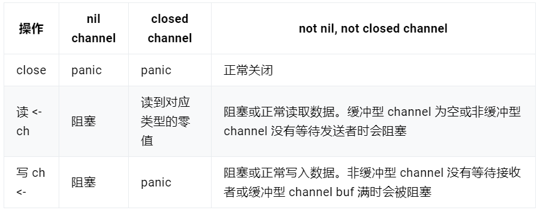

# channel
新建一个 chan 后，内存在堆上分配

- 给一个nil channel发送/接收数据，造成永远阻塞。
- 给一个已经关闭的channel发送数据，引起panic
- 从一个已经关闭的channel接收数据，如果缓冲区中为空，则返回一个0值
- 无缓冲的channel是同步的，而有缓冲的channel是非同步的，无缓冲区的channel当有接收者时才会接收发送的数据，而有缓冲区时，及时无人接收channel数据，发送的数据也将被接收并放到缓冲区中，等待有接受者接收。。
- 口诀：空nil读写阻塞，写关闭异常，读关闭空0。

  1. nil channel代表channel未初始化，向未初始化的channel读写数据会造成阻塞
  2. 关闭(close)未初始化的channel会引起panic。

- `switch`则是用来当if……else使用
- golang 中的 `select` 就是用来监听和 channel 有关的 IO 操作，当 IO 操作发生时，触发相应的动作。
- select 只能应用于 channel 的操作，既可以用于 channel 的数据接收，也可以用于 channel 的数据发送。如果 select 的多个分支都满足条件，则会随机的选取其中一个满足条件的分支执行。

# channel的关闭
close 逻辑比较简单，对于一个 channel，recvq 和 sendq 中分别保存了阻塞的发送者和接收者。关闭 channel 后，对于等待接收者而言，会收到一个相应类型的零值。对于等待发送者，会直接 panic。所以，在不了解 channel 还有没有接收者的情况下，不能贸然关闭 channel。

close 函数先上一把大锁，接着把所有挂在这个 channel 上的 sender 和 receiver 全都连成一个 sudog 链表，再解锁。最后，再将所有的 sudog 全都唤醒。

唤醒之后，该干嘛干嘛。sender 会继续执行 chansend 函数里 goparkunlock 函数之后的代码，很不幸，检测到 channel 已经关闭了，panic。receiver 则比较幸运，进行一些扫尾工作后，返回。这里，selected 返回 true，而返回值 received 则要根据 channel 是否关闭，返回不同的值。如果 channel 关闭，received 为 false，否则为 true。这我们分析的这种情况下，received 返回 false。

## channel关闭的写法
1. 在不改变 channel 自身状态的情况下，无法获知一个 channel 是否关闭。
2. 关闭一个 closed channel 会导致 panic。所以，如果关闭 channel 的一方在不知道 channel 是否处于关闭状态时就去贸然关闭 channel 是很危险的事情。
3. 向一个 closed channel 发送数据会导致 panic。所以，如果向 channel 发送数据的一方不知道 channel 是否处于关闭状态时就去贸然向 channel 发送数据是很危险的事情。

不要从一个 receiver 侧关闭 channel，也不要在有多个 sender 时，关闭 channel。

那到底应该如何优雅地关闭 channel？

根据 sender 和 receiver 的个数，分下面几种情况：

1. 一个 sender，一个 receiver
2. 一个 sender， M 个 receiver
   - 1和2的情况下，因为只有一个sender,所以可以直接从sender端直接关闭。
3. N 个 sender，一个 reciver
   - 解决方案就是增加一个传递关闭信号的 channel，receiver 通过信号 channel 下达关闭数据 channel 指令。senders 监听到关闭信号后，停止发送数据。
4. N 个 sender， M 个 receiver
   - 第 3 种情况不同，这里有 M 个 receiver，如果直接还是采取第 3 种解决方案，由 receiver 直接关闭 stopCh 的话，就会重复关闭一个 channel，导致 panic。因此需要增加一个中间人，M 个 receiver 都向它发送关闭 dataCh 的“请求”，中间人收到第一个请求后，就会直接下达关闭 dataCh 的指令（通过关闭 stopCh，这时就不会发生重复关闭的情况，因为 stopCh 的发送方只有中间人一个）。另外，这里的 N 个 sender 也可以向中间人发送关闭 dataCh 的请求。