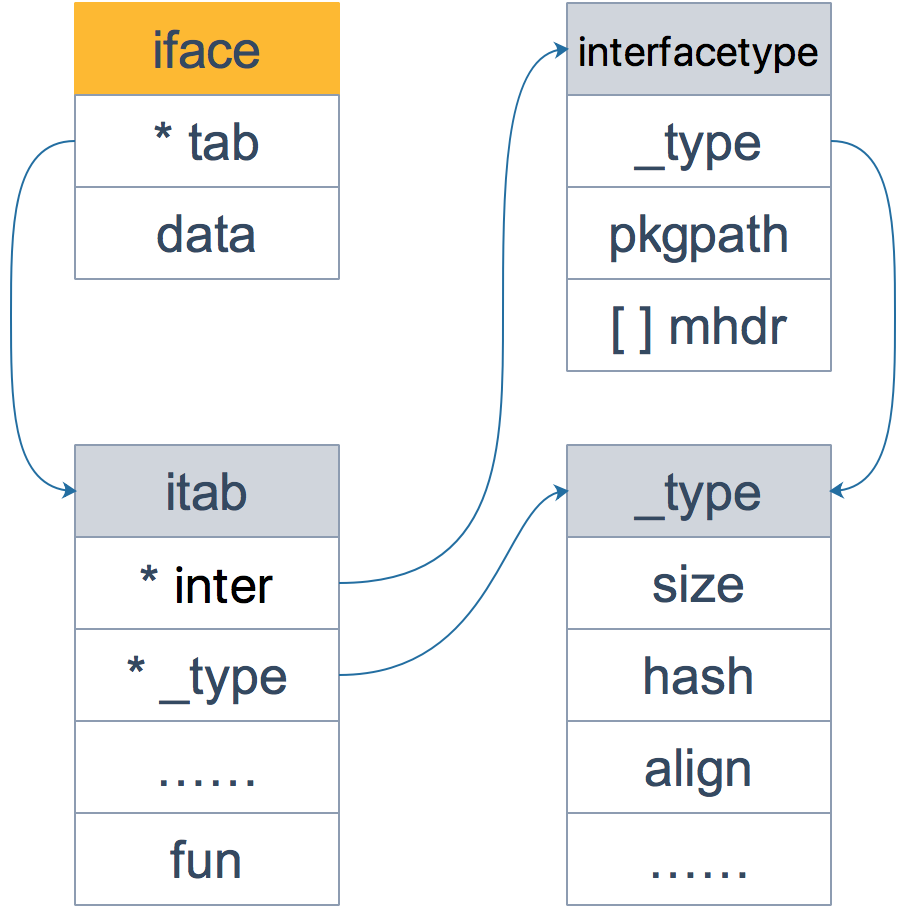

# 鴨子類型

鸭子类型是一种动态语言的风格，在这种风格中，一个对象有效的语义，不是由继承自特定的类或实现特定的接口，而是由它"当前方法和属性的集合"决定。Go 作为一种静态语言，通过接口实现了 鸭子类型，实际上是 Go 的编译器在其中作了隐匿的转换工作。

# 值接收者和指針接收者
如果实现了接收者是值类型的方法，会隐含地也实现了接收者是指针类型的方法。
-  如果方法的接收者是值类型，无论调用者是对象还是对象指针，修改的都是对象的副本，不影响调用者；如果方法的接收者是指针类型，则调用者修改的是指针指向的对象本身。

- 当实现了一个接收者是值类型的方法，就可以自动生成一个接收者是对应指针类型的方法，因为两者都不会影响接收者。但是，当实现了一个接收者是指针类型的方法，如果此时自动生成一个接收者是值类型的方法，原本期望对接收者的改变（通过指针实现），现在无法实现，因为值类型会产生一个拷贝，不会真正影响调用者。
- 使用指针作为方法的接收者的理由：
  - 方法能够修改接收者指向的值。
  - 避免在每次调用方法时复制该值，在值的类型为大型结构体时，这样做会更加高效。
# 什麼時候用值類型，什麼時候用指針類型

- 如果类型具备“原始的本质”，也就是说它的成员都是由 Go 语言里内置的原始类型，如字符串，整型值等，那就定义值接收者类型的方法。
- 如果是像内置的引用类型，如 slice，map，interface，channel不能被安全地复制，这种类型总是应该被共享，那就定义指针接收者的方法。
  - 比如 go 源码里的文件结构体（struct File）就不应该被复制，应该只有一份实体。

# iface 和 eface的區別

区别在于 iface 描述的接口包含方法，而 eface 则是不包含任何方法的空接口：interface{}。



【引申1】接口类型和 nil 作比较

接口值的零值是指动态类型和动态值都为 nil。当仅且当这两部分的值都为 nil 的情况下，这个接口值就才会被认为 接口值 == nil。

# 断言 
前面说过，因为空接口 interface{} 没有定义任何函数，因此 Go 中所有类型都实现了空接口。当一个函数的形参是 interface{}，那么在函数中，需要对形参进行断言，从而得到它的真实类型。

- 断言的语法为：
```
<目标类型的值>，<布尔参数> := <表达式>.( 目标类型 ) // 安全类型断言 <目标类型的值> := <表达式>.( 目标类型 )　　//非安全类型断言
```
##  fmt.Println
【引申1】 fmt.Println 函数的参数是 interface。对于内置类型，函数内部会用穷举法，得出它的真实类型，然后转换为字符串打印。而对于自定义类型，首先确定该类型是否实现了 String() 方法，如果实现了，则直接打印输出 String() 方法的结果；否则，会通过反射来遍历对象的成员进行打印。

# c++和go之間對接口的區別

接口定义了一种规范，描述了类的行为和功能，而不做具体实现。

C++ 定义接口的方式称为“侵入式”，而 Go 采用的是 “非侵入式”，不需要显式声明，只需要实现接口定义的函数，编译器自动会识别。
- C++ 的接口是使用抽象类来实现的，如果类中至少有一个函数被声明为纯虚函数，则这个类就是抽象类。纯虚函数是通过在声明中使用 “= 0” 来指定的。
  - 设计抽象类的目的，是为了给其他类提供一个可以继承的适当的基类。抽象类不能被用于实例化对象，它只能作为接口使用。
```c++
class Shape
{
   public:
      // 纯虚函数
      virtual double getArea() = 0;
   private:
      string name;      // 名称
};
```