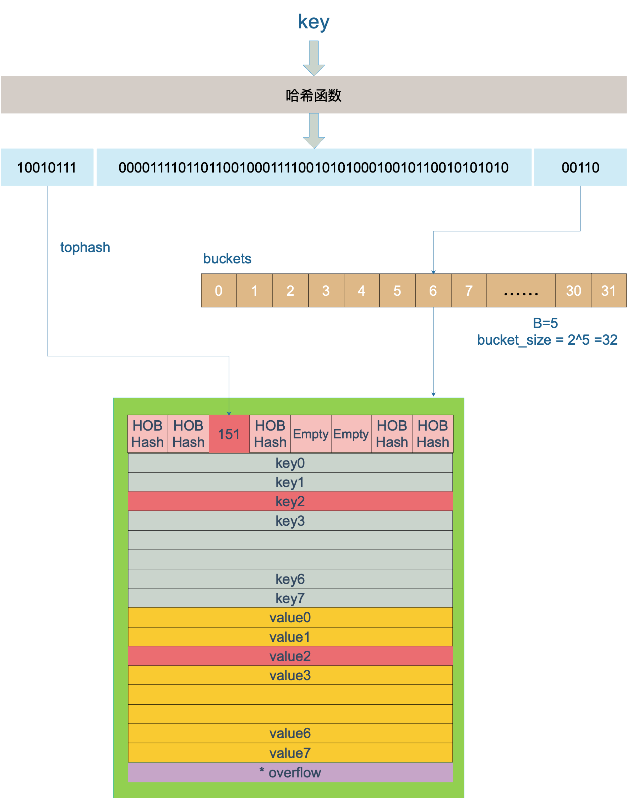

# Map

定义：map 是由 key-value 对组成的；key 只会出现一次

map 的设计也被称为 “The dictionary problem”，它的任务是设计一种数据结构用来维护一个集合的数据，并且可以同时对集合进行增删查改的操作。最主要的数据结构有两种：`哈希查找表（Hash table）`、`搜索树（Search tree）`。

1. 哈希查找表用一个哈希函数将 key 分配到不同的桶（bucket，也就是数组的不同 index）。这样，开销主要在哈希函数的计算以及数组的常数访问时间。在很多场景下，哈希查找表的性能很高。
    - 给定表M，存在函数f(key)，对任意给定的关键字值key，代入函数后若能得到包含该关键字的记录在表中的地址，则称表M为哈希（Hash）表，函数f(key)为哈希(Hash) 函数。
   - 哈希查找表一般会存在“碰撞”的问题，就是说不同的 key 被哈希到了同一个 bucket。一般有两种应对方法：链表法和开放地址法。
     1. 链表法将一个 bucket 实现成一个链表，落在同一个 bucket 中的 key 都会插入这个链表。
     2. 开放地址法则是碰撞发生后，通过一定的规律，在数组的后面挑选“空位”，用来放置新的 key。

2. 搜索树法一般采用自平衡搜索树，包括：AVL 树，红黑树。面试时经常会被问到，甚至被要求手写红黑树代码，很多时候，面试官自己都写不上来，非常过分。

   - 自平衡搜索树法的最差搜索效率是 O(logN)，而哈希查找表最差是 O(N)。当然，哈希查找表的平均查找效率是 O(1)，如果哈希函数设计的很好，最坏的情况基本不会出现。

还有一点，遍历自平衡搜索树，返回的 key 序列，一般会按照从小到大的顺序；而哈希查找表则是乱序的。

map 的一个关键点在于，哈希函数的选择。在程序启动时，会检测 cpu 是否支持 aes，如果支持，则使用 aes hash，否则使用 memhash。


上图就是 bucket 的内存模型，HOB Hash 指的就是 top hash。 注意到 key 和 value 是各自放在一起的，并不是 key/value/key/value/... 这样的形式。源码里说明这样的好处是在某些情况下可以省略掉 padding 字段，节省内存空间。

例如，有这样一个类型的 map：
```
map[int64]int8
```
如果按照 key/value/key/value/... 这样的模式存储，那在每一个 key/value 对之后都要额外 padding 7 个字节；而将所有的 key，value 分别绑定到一起，这种形式 key/key/.../value/value/...，则只需要在最后添加 padding。

每个 bucket 设计成最多只能放 8 个 key-value 对，如果有第 9 个 key-value 落入当前的 bucket，那就需要再构建一个 bucket ，通过 overflow 指针连接起来。

【引申1】slice 和 map 分别作为函数参数时有什么区别？
- makemap 和 makeslice 的区别，带来一个不同点：当 map 和 slice 作为函数参数时，在函数参数内部对 map 的操作会影响 map 自身；而对 slice 却不会（之前讲 slice 的文章里有讲过）。
  - 主要原因：一个是指针（*hmap），一个是结构体（slice）。Go 语言中的函数传参都是值传递，在函数内部，参数会被 copy 到本地。*hmap指针 copy 完之后，仍然指向同一个 map，因此函数内部对 map 的操作会影响实参。而 slice 被 copy 后，会成为一个新的 slice，对它进行的操作不会影响到实参。

## 哈希函数
key 经过哈希计算后得到哈希值，共 64 个 bit 位（64位机，32位机就不讨论了，现在主流都是64位机），计算它到底要落在哪个桶时，只会用到最后 B 个 bit 位。还记得前面提到过的 B 吗？如果 B = 5，那么桶的数量，也就是 buckets 数组的长度是 2^5 = 32。

例如，现在有一个 key 经过哈希函数计算后，得到的哈希结果是：

```
10010111 | 000011110110110010001111001010100010010110010101010 │ 01010
```
用最后的 5 个 bit 位，也就是 01010，值为 10，也就是 10 号桶。这个操作实际上就是取余操作，但是取余开销太大，所以代码实现上用的位操作代替。

再用哈希值的高 8 位，找到此 key 在 bucket 中的位置，这是在寻找已有的 key。最开始桶内还没有 key，新加入的 key 会找到第一个空位，放入。

buckets 编号就是桶编号，当两个不同的 key 落在同一个桶中，也就是发生了哈希冲突。冲突的解决手段是用链表法：在 bucket 中，从前往后找到第一个空位。这样，在查找某个 key 时，先找到对应的桶，再去遍历 bucket 中的 key。


上图中，假定 B = 5，所以 bucket 总数就是 2^5 = 32。首先计算出待查找 key 的哈希，使用低 5 位 00110，找到对应的 6 号 bucket，使用高 8 位 10010111，对应十进制 151，在 6 号 bucket 中寻找 tophash 值（HOB hash）为 151 的 key，找到了 2 号槽位，这样整个查找过程就结束了。

如果在 bucket 中没找到，并且 overflow 不为空，还要继续去 overflow bucket 中寻找，直到找到或是所有的 key 槽位都找遍了，包括所有的 overflow bucket。

1. 当我们在遍历 map 时，并不是固定地从 0 号 bucket 开始遍历，每次都是从一个随机值序号的 bucket 开始遍历，并且是从这个 bucket 的一个随机序号的 cell 开始遍历。这样，即使你是一个写死的 map，仅仅只是遍历它，也不太可能会返回一个固定序列的 key/value 对了。
    -   多说一句，“迭代 map 的结果是无序的”这个特性是从 go 1.0 开始加入的。
    - ：float 型可以作为 key，但是由于精度的问题，会导致一些诡异的问题，慎用之。
- map 并不是一个线程安全的数据结构。同时读写一个 map 是未定义的行为，如果被检测到，会直接 panic。

  - 上面说的是发生在多个协程同时读写同一个 map 的情况下。 如果在同一个协程内边遍历边删除，并不会检测到同时读写，理论上是可以这样做的。但是，遍历的结果就可能不会是相同的了，有可能结果遍历结果集中包含了删除的 key，也有可能不包含，这取决于删除 key 的时间：是在遍历到 key 所在的 bucket 时刻前或者后。
## float可作為map的kay嗎？
答：可以，Go 语言中只要是可比较的类型都可以作为 key。除开 slice，map，functions 这几种类型，其他类型都是 OK 的
当用 float64 作为 key 的时候，先要将其转成 uint64 类型，再插入 key 中。
## 比较map相等
```
Amap == Bmap 只能比较出两个是不是都为空
```
- map 深度相等的条件：
```
1、都为 nil
2、非空、长度相等，指向同一个 map 实体对象
3、相应的 key 指向的 value “深度”相等
```
因此只能是遍历map 的每个元素，比较元素是否都是深度相等。