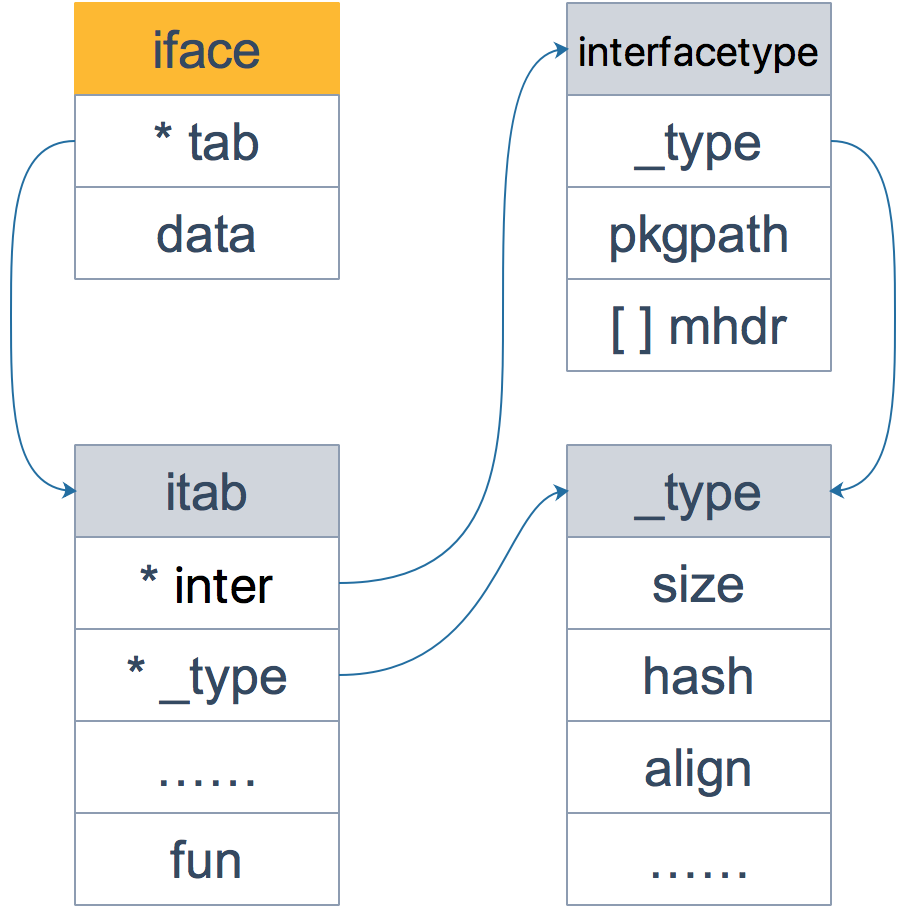

[go面试宝典](https://golang.design/go-questions/slice/vs-array/)

slice 的底层数据是数组，slice 是对数组的封装，它描述一个数组的片段。两者都可以通过下标来访问单个元素。

数组是定长的，长度定义好之后，不能再更改。在 Go 中，数组是不常见的，因为其长度是类型的一部分，限制了它的表达能力，比如 [3]int 和 [4]int 就是不同的类型。

而切片则非常灵活，它可以动态地扩容。切片的类型和长度无关。

数组就是一片连续的内存，`slice 实际上是一个结构体，包含三个字段：长度、容量、底层数组`。


1. slice打印输出时只会输出len长度的内容。即使他cap>len
    - 设s=[0,1,2,3,4,5,6,7,8,9],s[2:5:7],len=5-2,cap=7-2
    - 向 slice 追加元素的时候，若容量不够，会调用 growslice 函数
    - 同时，为了应对未来可能再次发生的 append 操作，新的底层数组的长度，也就是新 slice 的容量是留了一定的 buffer 的。 
2. 在`golang1.18`版本更新之前当原 slice 容量小于 1024 的时候，新 slice 容量变成原来的 2 倍；原 slice 容量超过 1024，新 slice 容量变成原来的1.25倍（考证之后大概是1.3倍，不是这个算法）。更新后：当原slice容量(oldcap)小于256的时候，新slice(newcap)容量为原来的2倍；原slice容量超过256，新slice容量newcap = oldcap+(oldcap+3*256)/4
   - 看源码之后，计算方式是：如果扩容两倍还是不够append,那么将会将新的容量变为append之后的长度len,由这个新的cap为参数乘以指针大小（代码中ptrSize是指一个指针的大小，在64位机上是8），调用roundupsize函数获取到设定好的扩充量。
3. Go 语言的函数参数传递，只有值传递，没有引用传递。
   - 之所以切片作为参数在函数中改变会改变底层数组，是因为切片本身就是一个结构体，而其中指向切片底层数组的成员是一个引用的数组，所以在函数内改变该切片的array将改变底层数组的值。

- 【引申2】 向一个nil的slice添加元素会发生什么？为什么？

  - 其实 nil slice 或者 empty slice 都是可以通过调用 append 函数来获得底层数组的扩容。最终都是调用 mallocgc 来向 Go 的内存管理器申请到一块内存，然后再赋给原来的nil slice 或 empty slice，然后摇身一变，成为“真正”的 slice 了。


向 slice 追加元素的时候，若容量不够，会调用 growslice 函数，所以我们直接看它的代码。
```
// go 1.9.5 src/runtime/slice.go:82
func growslice(et *_type, old slice, cap int) slice {
    // ……
    newcap := old.cap
	doublecap := newcap + newcap
	if cap > doublecap {
		newcap = cap
	} else {
		if old.len < 1024 {
			newcap = doublecap
		} else {
			for newcap < cap {
				newcap += newcap / 4
			}
		}
	}
	// ……
	
	capmem = roundupsize(uintptr(newcap) * ptrSize)
	newcap = int(capmem / ptrSize)
}
```
```
package main

import "fmt"

func main() {
	s := []int{1,2}
	s = append(s,4,5,6)
	fmt.Printf("len=%d, cap=%d",len(s),cap(s))
}
```
这个函数的参数依次是 元素的类型，老的 slice，新 slice 最小求的容量。

例子中 s 原来只有 2 个元素，len 和 cap 都为 2，append 了三个元素后，长度变为 5，容量最小要变成 5，即调用 growslice 函数时，传入的第三个参数应该为 5。即 cap=5。而一方面，doublecap 是原 slice容量的 2 倍，等于 4。满足第一个 if 条件，所以 newcap 变成了 5。

接着调用了 roundupsize 函数，传入 40。（代码中ptrSize是指一个指针的大小，在64位机上是8）

- 现实是，后半部分还对 newcap 作了一个内存对齐，这个和内存分配策略相关。进行内存对齐之后，新 slice 的容量是要 大于等于 按照前半部分生成的newcap。之后，向 Go 内存管理器申请内存，将老 slice 中的数据复制过去，并且将 append 的元素添加到新的底层数组中。
```
package main

import "fmt"

func main() {
    s := []int{5}
    s = append(s, 7)
    s = append(s, 9)
    x := append(s, 11)
    y := append(s, 12)
    fmt.Println(s, x, y)
}

```
- 这里要注意的是，append函数执行完后，返回的是一个全新的 slice，并且对传入的 slice 并不影响。输出为：
```
[5 7 9] [5 7 9 12] [5 7 9 12]
```



