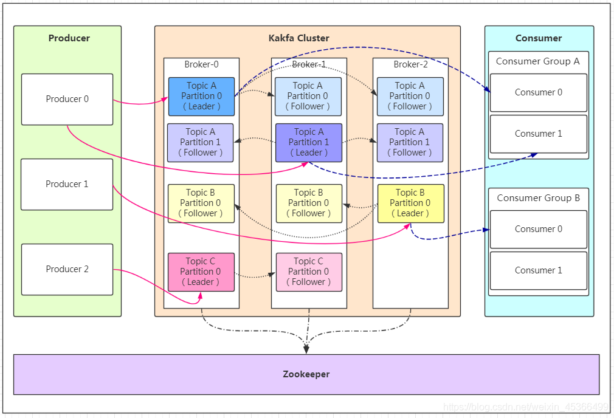
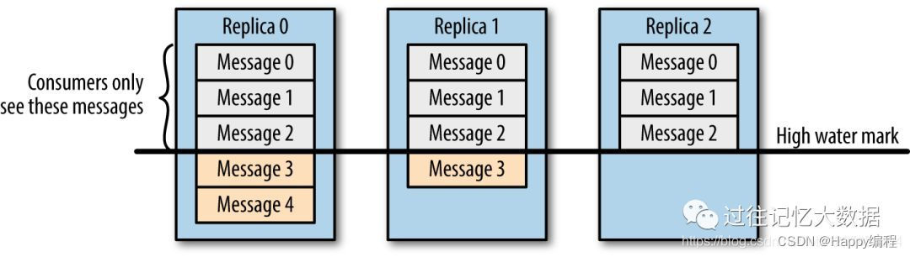

# kafka
## 架构

- Producer：Producer即生产者，消息的产生者，是消息的入口。
- Broker：Broker是kafka实例，每个服务器上有一个或多个kafka的实例，我们姑且认为每个broker对应一台服务器。每个kafka集群内的broker都有一个不重复的编号，如图中的broker-0、broker-1等……
- Topic：消息的主题，可以理解为消息的分类，kafka的数据就保存在topic。在每个broker上都可以创建多个topic。
- Partition：Topic的分区，每个topic可以有多个分区，分区的作用是做负载，提高kafka的吞吐量。同一个topic在不同的分区的数据是不重复的，partition的表现形式就是一个一个的文件夹！
- Replication:每一个分区都有多个副本，副本的作用是做备胎。当主分区（Leader）故障的时候会选择一个备胎（Follower）上位，成为Leader。在kafka中默认副本的最大数量是10个，且副本的数量不能大于Broker的数量，follower和leader绝对是在不同的机器，同一机器对同一个分区也只可能存放一个副本（包括自己）。
- Message：每一条发送的消息主体。
- Consumer：消费者，即消息的消费方，是消息的出口。
- Consumer Group：我们可以将多个消费组组成一个消费者组，在kafka的设计中同一个分区的数据只能被消费者组中的某一个消费者消费。同一个消费者组的消费者可以消费同一个topic的不同分区的数据，这也是为了提高kafka的吞吐量！
- Zookeeper：kafka集群依赖zookeeper来保存集群的的元信息，来保证系统的可用性。

## 请简述下你在哪些场景下会选择 Kafka？
    •日志收集：一个公司可以用Kafka可以收集各种服务的log，通过kafka以统一接口服务的方式开放给各种consumer，例如hadoop、HBase、Solr等。
    •消息系统：解耦和生产者和消费者、缓存消息等。
    •用户活动跟踪：Kafka经常被用来记录web用户或者app用户的各种活动，如浏览网页、搜索、点击等活动，这些活动信息被各个服务器发布到kafka的topic中，然后订阅者通过订阅这些topic来做实时的监控分析，或者装载到hadoop、数据仓库中做离线分析和挖掘。
    •运营指标：Kafka也经常用来记录运营监控数据。包括收集各种分布式应用的数据，生产各种操作的集中反馈，比如报警和报告。
    •流式处理：比如spark streaming和 Flink

## Kafka 数据一致性原理
一致性就是说不论是老的 Leader 还是新选举的 Leader，Consumer 都能读到一样的数据。

假设分区的副本为3，其中副本0是 Leader，副本1和副本2是 follower，并且在 ISR 列表里面。虽然副本0已经写入了 Message4，但是 Consumer 只能读取到 Message2。因为所有的 ISR 都同步了 Message2，只有 High Water Mark 以上的消息才支持 Consumer 读取，而 High Water Mark 取决于 ISR 列表里面偏移量最小的分区，对应于上图的副本2，这个很类似于木桶原理。

这样做的原因是还没有被足够多副本复制的消息被认为是“不安全”的，如果 Leader 发生崩溃，另一个副本成为新 Leader，那么这些消息很可能丢失了。如果我们允许消费者读取这些消息，可能就会破坏一致性。试想，一个消费者从当前 Leader（副本0） 读取并处理了 Message4，这个时候 Leader 挂掉了，选举了副本1为新的 Leader，这时候另一个消费者再去从新的 Leader 读取消息，发现这个消息其实并不存在，这就导致了数据不一致性问题。

当然，引入了 High Water Mark 机制，会导致 Broker 间的消息复制因为某些原因变慢，那么消息到达消费者的时间也会随之变长（因为我们会先等待消息复制完毕）。延迟时间可以通过参数 replica.lag.time.max.ms 参数配置，它指定了副本在复制消息时可被允许的最大延迟时间。