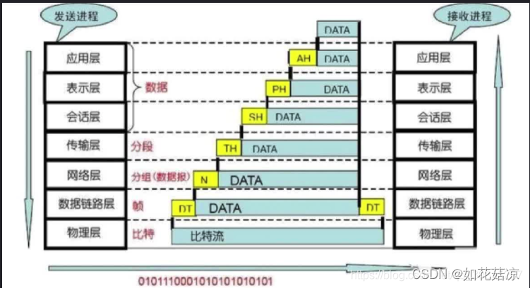
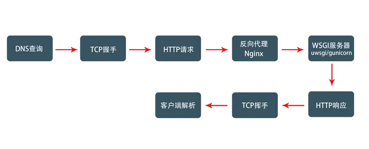
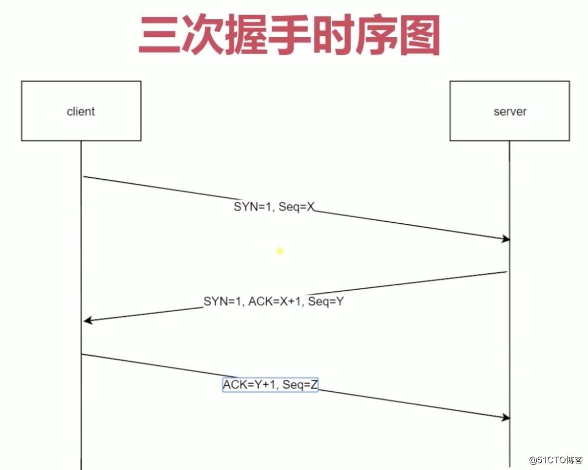

# OSI模型

OSI将计算机网络体系结构(architecture）划分为以下七层：
1. 物理层: 将数据转换为可通过物理介质传送的电子信号 相当于邮局中的搬运工人。
2. 数据链路层: 决定访问网络介质的方式。 在此层将数据分帧，并处理流控制。本层指定拓扑结构并提供硬件寻址，相当于邮局中的装拆箱工人。
3. 网络层: 使用权数据路由经过大型网络 相当于邮局中的排序工人。
4. 传输层: 提供终端到终端的可靠连接 相当于公司中跑邮局的送信职员。
5. 会话层: 允许用户使用简单易记的名称建立连接 相当于公司中收寄信、写信封与拆信封的秘书。
6. 表示层: 协商数据交换格式 相当公司中简报老板、替老板写信的助理。
7. 应用层: 用户的应用程序和网络之间的接口。

## 五层
从上往下分别是：
1. 应用层
2. 传输层
3. 网络层
4. 数据链路层
5. 物理层
# HTTP

http协议是属于应用层。

在浏览器中输入一个 URL 中间经历的过程:

- 1.当浏览器发起请求的时候，并不会先做查询，而是查看浏览器的 DNS 缓存和操作系统的 DNS 缓存有没有相应网址的映射，如果有，则调用，如果都没有，就会发起一个 DNS 查询，浏览器通过 IP 地址与 Web 服务器通信

- 2.获取到ip地址后，浏览器就可以调用 socket 函数，发起TCP请求，通过三次握手建立连接

- 3.客户端通过 TCP 套接字向 Web 服务器发送 HTTP 请求。

  - 一个请求报文由请求行、请求头、空行和请求数据 4 部分组成

  - HTTP请求一开始并没有先打到 web 应用上，而是先打到反向代理 Nginx（Nginx 是一个高性能的静态服务器， 很多访问量比较高的网站都会使用 Nginx 来负载均衡，可以把请求通过 Nginx 转换到动态服务器上，增大吞吐量）
  - Nginx 再将请求转发到 WSGI 服务器上(WSGI是 Web Server Gateway Interface 的缩写, 它是 web 框架与 Web 服务器之间的一种接口, 常用的 web 服务器软件有 uWSGI，Gunicorn等), WSGI 服务器接受并解析请求，再将请求发送给后端 web 应用。

- 4.Web 服务器接受请求并返回 HTTP 响应，服务器将资源复本写到 TCP 套接字，由客户端读取。
  - 一个HTTP响应由状态行(包含版本号、状态代码、描述)、响应头部、空行和响应数据 4 部分组成。

- 5.若没有其他数据传输，则通过 TCP 四次挥手释放连接

- 6.客户端读取响应数据 HTML，根据 HTML 的语法对其进行格式化，并在浏览器窗口中显示。

### HTTP的三次握手：

- 第一次握手: 建立连接，客户端A发送SYN=1、随机产生Seq=client_isn的数据包到服务器B，等待服务器确认。

- 第二次握手: 服务器B收到请求后确认联机(可以接受数据)，发起第二次握手请求，ACK=(A的Seq+1)、SYN=1，随机产生Seq=client_isn的数据包到A。

- 第三次握手: A收到后检查ACK是否正确，若正确，A会在发送确认包ACK=服务器B的Seq+1，服务器B收到后确认Seq值与ACK值，若正确，则建立连接。

至于为什么要经过三次握手呢，是为了防止服务端开启一些无用的链接，网络传输是有延时的，中间可能隔着非常远的距离，通过光纤或者中间代理服务器等，客户端发送一个请求，服务端收到之后如果直接创建一个链接，返回内容给到客户端，因为网络传输原因，这个数据包丢失了，客户端就一直接收不到服务器返回的这个数据，超过了客户端设置的时间就关闭了，那么这时候服务端是不知道的，它的端口就会开着等待客户端发送实际的请求数据，服务这个开销也就浪费掉了
    
位码即tcp标志位，有6种标示：

①  SYN(synchronous建立联机)；

②  ACK(acknowledgement 确认)

③  PSH(push传送)

④  FIN(finish结束)

⑤  RST(reset重置)

⑥  URG(urgent紧急)

Sequence number(顺序号码) //Acknowledge number(确认号码)

### 四次挥手：
- 1、当客户端无数据要传输了，会发送FIN码告诉服务器，我发送完毕了；

- 2、当服务端接收完毕后，告诉客户端ACK码，告诉客户端你可以把数据通道关闭了；

- 3、当服务器发送完毕之后，也会发送FIN码，告诉客户端，数据发送完毕，我要关闭了；
     
- 4、当客户端接收完毕 之后，同样发送ACK码，告诉服务器，数据接收完毕，你可以关闭；

三次握手和四次挥手的好处：确保数据的安全和完整
## HTTP的方法
- GET ：获取数据。
- POST ：提交数据。
- PUT ：更新数据。
- DELETE ：删除数据。

GET请求会将参数放到url中，是明文传输,有长度限制，POST 将参数放在请求体，更安全 。

## 常见的状态码

### 1xx 消息：Informational（信息性状态码），表示服务器收到请求，需要请求者继续执行操作

### 2xx 消息：Success（成功状态码），表示操作被成功接受并处理

200成功

### 3xx 消息：Redirection（重定向状态码），需要进一步操作完成请求。

301永久重定向
302临时重定向

### 4xx 消息：Client Error（客户端错误状态码），表示请求有语法错误或者无法完成请求 。

- 400请求错误
- 401未认证
- 403被禁止
- 404页面找不到
- 405方法未定义

### 5xx 消息：Server Error（服务器错误状态码），服务器在处理请求的过程中发生错误。

