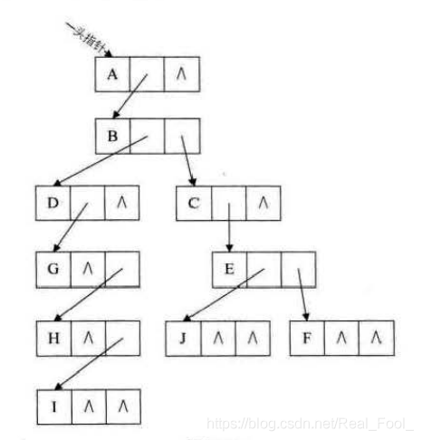

# 树
## 树的存储结构
1. 双亲表示法
   - 在每个节点中， 带一个双亲的地址/指针
2. 孩子表示法
   - 在每个节点中以单链表的形式存储孩子节点的位置。
   - 两种数据结构，一种是孩子：child_data|next_child 一种是表头节点：data|first_child
3. 孩子兄弟表示法(二叉树)
   - data|left_data|right_data
   

## 二叉排序树
左子树上所有结点的关键字均小于根结点的关键字;

右子树上的所有结点的关键字均大于根结点的关键字;

左子树和右子树又各是一棵二叉排序树。

## 哈夫曼树
哈夫曼树的定义和原理
在许多应用中，树中结点常常被赋予一个表示某种意义的数值，称为该结点的权。从树的根到任意结点的路径长度(经过的边数)与该结点上权值的乘积，称为该结点的带权路径长度。树中所有叶结点的带权路径长度之和称为该树的带权路径长度

### 哈夫曼编码
哈夫曼编码是一种被广泛应用而且非常有效的数据压缩编码。
